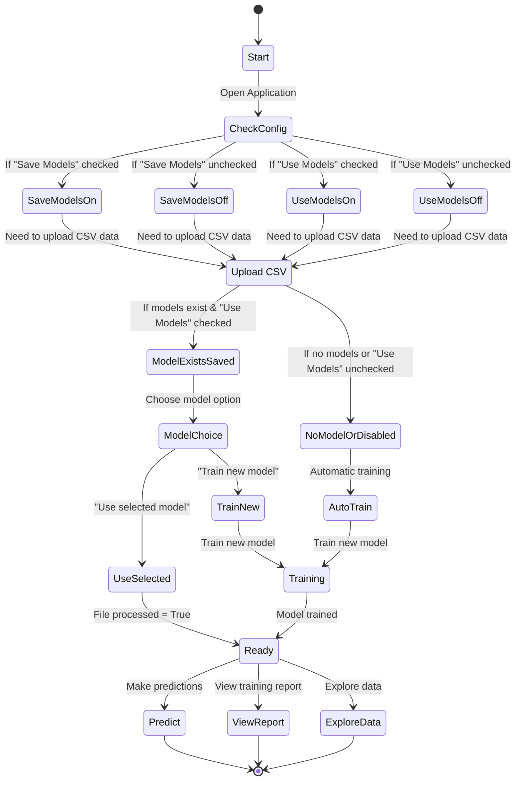

# Music Preference Predictor Documentation

## State Diagram & User Flow



### Decision Tree Logic

1. **Configuration Settings**
   - **Save Models** (on/off): Controls whether trained models are saved to disk
   - **Use Models** (on/off): Controls whether existing models can be loaded

2. **Model Selection Flow**
   - If no models exist OR "Use Models" is off: Automatically train new model
   - If models exist AND "Use Models" is on: Choose between using selected model or training new

3. **Model Usage States**
   - **Using newly trained model**: Set when training a new model
   - **Using selected model**: Set when choosing to use an existing model
   - These states control which model is used for predictions and which report is displayed

## How It Works

### 1. Data & Model Tab

This tab handles data upload and model selection/training.

**Features:**
- CSV file upload interface
- Data preview display
- Model dropdown selector
- Options to use selected model or train new model
- Automatic model training when no models exist

**States:**
- When a model is trained: `using_newly_trained_model = True`
- When existing model is selected: `using_newly_trained_model = False`


### 2. Prediction Tab

This tab allows users to input their age and gender to receive music genre predictions.

**Features:**
- Gender selection (Male/Female)
- Age slider
- Prediction results showing:
  - Percentage-based prediction with confidence
  - ML-based prediction with confidence
- Display of which model is being used for predictions

**Prediction Methods:**
- **Percentage-based:** Analysis of similar users in the dataset
- **Machine Learning:** Random Forest classifier predictions


### 3. Training Report Tab

This tab displays detailed metrics and visualizations of model performance.

**Features:**
- PDF report download
- Performance metrics tables (accuracy, precision, recall, F1 score)
- Per-class metrics
- Visualizations:
  - Confusion matrix
  - Feature importance chart
  - Decision tree visualization

**Report Selection Logic:**
- For newly trained models, displays most recent report 
- For selected existing models, displays matching report


### 4. Explore Data Tab

This tab enables interactive exploration of the dataset.

**Features:**
- Filtering controls (age range, gender, genre)
- Three visualization types:
  - Genre distribution
  - Age distribution
  - Combined analysis (heatmaps and comparisons)
- Raw data view option


### 5. Configuration Sidebar

The sidebar allows customizing application settings.

**Settings:**
- **Model Settings:**
  - Save trained models
  - Use saved models
  - Number of estimators
- **Data Settings:**
  - Save uploaded files
- **App Settings:**
  - Default age
- **Logging Settings:**
  - Logging level


## Installation & Getting Started

### Prerequisites

- Python 3.8 or higher
- pip (Python package manager)

### Installation Steps

1. **Clone the repository:**
   ```bash
   git clone https://github.com/yourusername/music-preference-predictor.git
   cd music-preference-predictor
   ```

2. **Create and activate a virtual environment:**
   ```bash
   python -m venv venv
   
   # On Windows
   venv\Scripts\activate
   
   # On macOS/Linux
   source venv/bin/activate
   ```

3. **Install dependencies:**
   ```bash
   pip install -r requirements.txt
   ```

### Running the Application

1. **Start the Streamlit server:**
   ```bash
   python main.py
   ```
   Alternatively, you can run:
   ```bash
   streamlit run music/app/__init__.py
   ```

2. **Access the application:**
   The application will automatically open in your browser, or you can access it at:
   ```
   http://localhost:8501
   ```

### Expected Directory Structure

```
music-preference-predictor/
├── main.py
├── requirements.txt
├── music/
│   ├── app/
│   │   ├── __init__.py
│   │   ├── app.py
│   │   ├── config_sidebar.py
│   │   ├── visualizations.py
│   │   ├── utils.py
│   │   └── tabs/
│   │       ├── __init__.py
│   │       ├── data_model_tab.py
│   │       ├── prediction_tab.py
│   │       ├── report_tab.py
│   │       └── explore_tab.py
│   ├── core/
│   │   ├── __init__.py
│   │   ├── config.py
│   │   └── logging.py
│   ├── logs/
│   │   └── app.log
│   ├── models/
│   │   └── train_reports/
│   ├── prediction/
│   │   ├── __init__.py
│   │   ├── percentage.py
│   │   ├── random_forest.py
│   │   └── train_rf.py
│   └── uploads/
└── config.yaml
```

### First Steps

1. Launch the application
2. Upload a CSV file with columns for:
   - `age`: Numeric
   - `gender`: 0 for Female, 1 for Male
   - `genre`: Music genre category
3. Choose whether to use an existing model or train a new one
4. Navigate to the Prediction tab to make predictions
5. Explore the Training Report and Data Exploration tabs

The application will create necessary directories automatically on first run and generate a default configuration file if one doesn't exist.